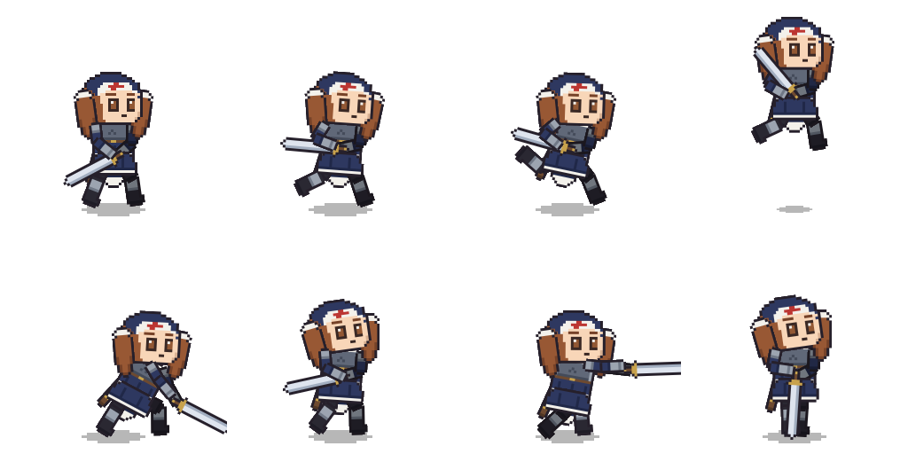

# knight-nun — Elara (sample)

エララ, a nun in plate with a holy sword: a **sample customization** of
the `chibi-sword` preset, built by following the
`skills/lottie-character-preset` workflow. All 19 clips and the state
machine are the preset's own motion data, untouched; the sixteen rig
parts were redrawn and five decoration slots were added.

This is sample data, **not a template**. The templates the editor's New…
dialog offers stay `chibi-male` and `chibi-sword`.



## What was redrawn

| slot group | chibi-sword | knight-nun |
|---|---|---|
| head / head-side / head-back | flat teal ball | navy veil over a white coif with the red cross, big eyes, brown hair framing the face |
| body / body-side / body-back | flat green + belt | steel cuirass over the habit, gold-buckled belt, navy pleats; the back carries the steel cross |
| upper arms | flat pink | pauldron over a navy sleeve |
| forearms | flat pink | sleeve into a steel gauntlet |
| thighs / shins | flat blue | black thigh-highs, armored greaves over boots |
| sword | plain steel | gold pommel and crossguard over a leather grip |
| shadow | unchanged | unchanged |

Sizes, anchors and file names follow the rig contract
(`skills/lottie-character-preset/references/rig.md`), including the
sword's own 21x78 slot and the x0.72 darkening on far-side parts. Part
files keep their `chibi-sword-*` names on purpose — clips address assets
by those names, and only the bundle filename changes.

## What was added

The character sheet carries things that cannot be painted onto an
existing part, because they have to move independently of it:

| slot | size | anchor | parent | attach | why a slot |
|---|---|---|---|---|---|
| skirt | 54x27 | (27,3) | body | (24,40) | the thighs swing under it; painted on the torso it would swing with them |
| cape | 30x66 | (15,4) | body | (24,16) | the veil's tail hangs behind everything but the shadow |
| scabbard | 12x51 | (6,4) | body | (8,30) | rides the trailing hip, behind the torso |
| tail-near / tail-far | 24x57 | (12,4) | head | (2,24) / (70,24) | the twin-tails follow the HEAD, not the body, and mirror with it on a turn |

The two tails sit on opposite sides of the head in the layer order:
tail-far behind it, tail-near in front, so the trailing lock falls over
the cheek and the shoulder the way long hair does. Behind the head it
just peeked out at the silhouette's edge and read as part of it.

Each is parented to the part it hangs off and given a static transform.
Parenting alone carries them through every clip, which is why adding
them needed no new keyframes: the skirt tips with the hips, the tails
swing and mirror with the head, the veil follows the torso.

One thing from the sheet is deliberately not honored: it asks for 3.5
heads tall and the rig is 2.5. Proportions are the contract every clip
is built on, so the design is carried over at the rig's build instead.

## Rebuilding

The art is string-art, generated by [gen/gen.go](gen/gen.go). From this
directory:

```bash
go run ./gen -out parts
go run github.com/shibukawa/lottie-go/cmd/lottierepack -dump -dir work knight-nun.lottie
go run ./gen -out work/parts
go run github.com/shibukawa/lottie-go/cmd/lottierepack -dir work -out knight-nun.lottie
go run github.com/shibukawa/lottie-go/cmd/lottiecheck knight-nun.lottie
```

Open it in the editor:

```bash
cd ../../../cmd/lottie-state-editor && go run . ../../examples/state-editor/knight-nun/knight-nun.lottie
```
