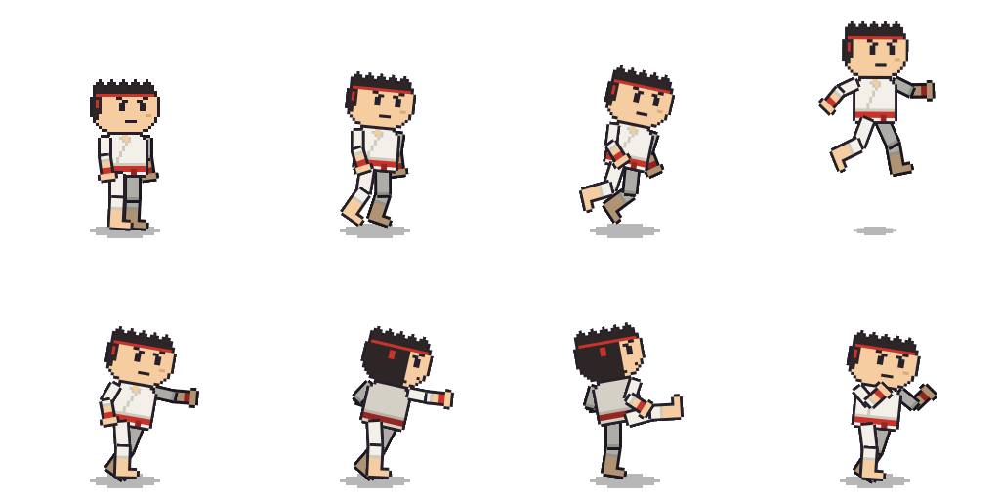

# karate-hero (sample)

A gi-clad martial artist with spiky hair and a red headband — a **sample
customization** of the `chibi-male` preset, produced by following the
`skills/lottie-character-preset` workflow end to end. It demonstrates the
design-swap contract: every one of the 19 clips and the state machine are
byte-for-byte the preset's own motion data; only the 15 part images were
redrawn.

This is sample data, **not a template**. The template the editor's New…
dialog offers stays `testdata/presets/chibi-male`.



## What was swapped

| slot group | chibi-male placeholder | karate-hero |
|---|---|---|
| head / head-side / head-back | flat teal ball | skin face with fierce angled brows and a gritted mouth, spiky hair, red headband with tails on the back |
| body / body-side / body-back | flat green + belt | white gi jacket, skin collar V, lapel line, red belt with knot; the back view is a dimmer gi so turns still read |
| upper arms | flat pink | gi sleeves hemmed at the elbow |
| forearms | flat pink | sleeve end, bare forearm, red wrist wrap, bare fist |
| thighs / shins | flat blue + shoe | gi trousers, bare shin, bare foot |
| shadow | unchanged | unchanged |

Sizes, anchors, and file names all match the rig contract
(`skills/lottie-character-preset/references/rig.md`); far-side parts keep
the preset's x0.72 depth darkening. Part files keep their `chibi-male-*`
slot names on purpose — clips address assets by those names, and the
skill's rename rule is that only the bundle filename changes.

## Rebuilding

The art is string-art, generated by [gen/gen.go](gen/gen.go). From this
directory:

```bash
go run ./gen -out parts
go run github.com/shibukawa/lottie-go/cmd/lottierepack -dump -dir work karate-hero.lottie
go run ./gen -out work/parts
go run github.com/shibukawa/lottie-go/cmd/lottierepack -dir work -out karate-hero.lottie
go run github.com/shibukawa/lottie-go/cmd/lottiecheck karate-hero.lottie
```

Watch it live while editing: `cd editor && go run . -viewer ../testdata/samples/karate-hero/karate-hero.lottie`.
